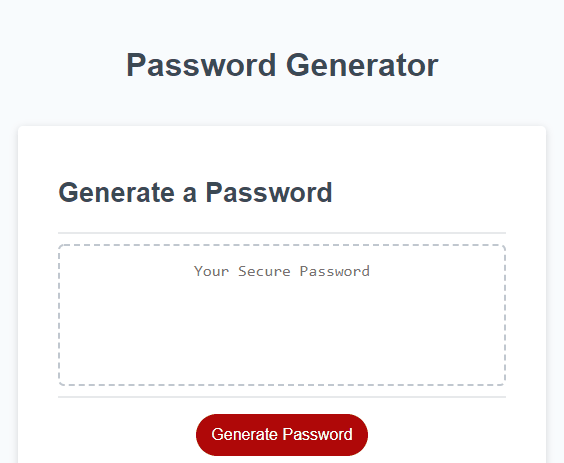
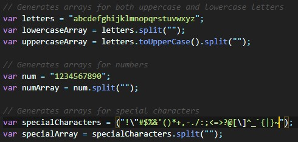

# Random Password Generator

This is a password generator that can generate a password using a selection of lowercase/uppercase letters, numbers and special characters. Any additional characters that you wish to add to those groups can be added without breaking functionality.

## Features

* Generate a random password in length from 8-128 characters.
* Choose to include lowercase, uppercase, numbers and/or special characters to your generated password.
* Easily add more characters to the generation pool by editing the character arrays in `script.js`.

## Usage

* Open up index.html.
* Click the Generate Password button.
* You will then be prompted to enter a number of characters to generate.
* Then you will be prompted to select the types of characters you wish to include in the generation.
* Finally, a randomly generated password will be shown on the page.

Link to a deployed version online can be found <a href="https://inknsharps.github.io/password_generator/">here</a>.

## Demos and Screenshots

### Password Generation

### Editable Arrays

## Credits

Columbia Engineering BCS for the initial HTML, CSS and JS work.

## Disclaimer

This is a project intended for showcasing coding work and practice. By using this application, the user holds that Neil Chen, the creator of this application does not take any responsibility for loss of property or accounts due to passwords generated by said application.