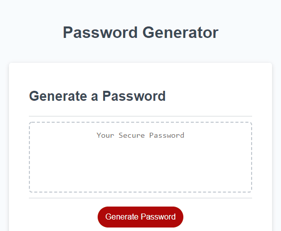
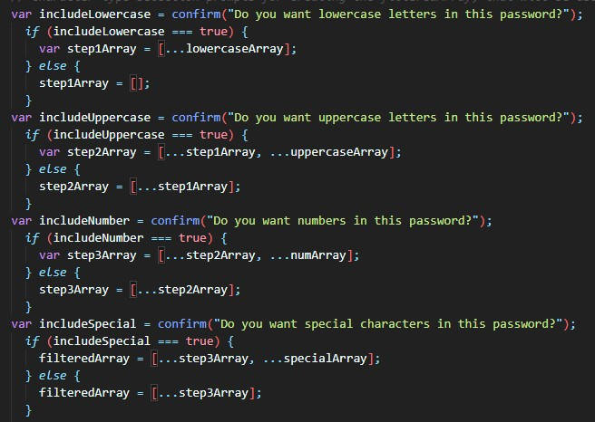
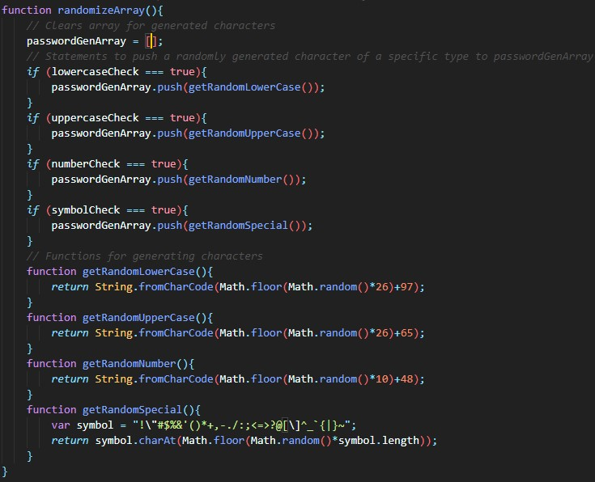
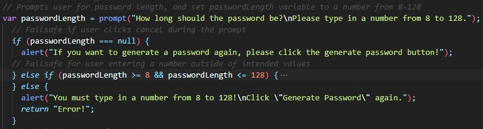
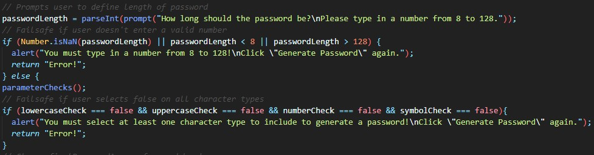

# Random Password Generator

This is a password generator that can generate a password using a selection of lowercase/uppercase letters, numbers and special characters.

## Features

* Generate a random password in length from 8-128 characters.
* Choose to include lowercase, uppercase, numbers and/or special characters to your generated password.

## Usage
 

 

* Open up index.html.
* Click the Generate Password button.
* You will then be prompted to enter a number of characters to generate.
* Then you will be prompted to select the types of characters you wish to include in the generation.
* Finally, a randomly generated password will be shown on the page.

Link to a deployed version online can be found <a href="https://inknsharps.github.io/password_generator/">here</a>.

## Notable Changes from v1 to v2

v1's Javascript code utilized predefined arrays for the character types and appended them together with the spread/`...` syntax, based on a sequence of `if...else` statements. The downside of this is the need of declaring new arrays each time a character type needed to be added to create the final array in which the password would be generated from. The code used a total of **9 different arrays!**

<figure>
  
  <figcaption>Lots of arrays and statements.</figcaption>
</figure>
 
 
v2 aims to cut down on the array reliance. It instead utilitizes a `.fromCharCode` method to generate characters randomly based on their UTF-16 character code. Unfortunately, this doesn't work great for symbols, so this is still defined as a string, but instead of converting it to an array, a simple `.charAt` method was applied to randomly pull a value from there. 
Another result of cutting down on array reliance is instead of generating a long array in which the password is generated from, we use the following sequence:
 

    1. We randomly generate a short array, which contains characters of the types we've chosen
    2. We grab a value from that short array and add it to our final password
    3. Repeat steps one and two until the password length is met.

This way, we only make use of **two arrays** in the entire solution. Pretty cool, huh?

<figure>
  
  <figcaption>Much more clean!</figcaption>
</figure>

In addition, the failsafes have been adjusted slightly. In particular, making use of the `parseInt()` function and `Number.isNaN()` function in the code has consolidated three `if...else` statements into one where:

    1. The user clicks cancel when selecting a value 
    2. The user types in a non `number` value
    3. The user types in a `number` not from 8-128

<figure>
    <figcaption>Here is v1's three if...else statements...</figcaption>
    
</figure>

<figure>
    <figcaption>...and v2 takes those three statements and combines them into one.</figcaption>
    
</figure>

## Credits

Columbia Engineering BCS for the initial HTML, CSS and JS work.
 
Florin Pop's <a href="https://codepen.io/FlorinPop17/pen/BaBePej">Random Password Generator</a> for inspiration on random password generation logic.

## Disclaimer

This is a project intended for showcasing coding work and practice. By using this application, the user holds that Neil Chen, the creator of this application does not take any responsibility for loss of property or accounts due to passwords generated by said application.